Health Statistical Study
================
*Written in french, this project is taken from the MSc Data Science and Complex System,
University of Strasbourg*

# Partie 1

Les données sur lesquelles se base cet exercice résument les habitudes
alimentaires de 180 individus et donnent des indications sur leur état
de santé selon trois critères spécifiques (taux de fer, de vitamines et
cholesterol).

*À noter : Tout au long de cette étude nous utiliserons abusivement la
formulation plus générale “état de santé de l’individu” sans préciser
qu’il s’agit évidemment d’une estimation faite uniquement à partir des
trois critères de santé que notre jeu de données
possède.*

| poulet | boeuf |  porc | poisson | … | taux.fer | taux.vitamines | cholesterol |
| -----: | ----: | ----: | ------: | :- | :------- | :------------- | :---------- |
|   5.52 |  8.17 | 11.63 |    0.78 | … | normal   | normal         | élevé       |
|   2.96 |  3.30 | 11.57 |    2.68 | … | bas      | normal         | élevé       |
|   2.48 |  4.86 |  2.46 |    1.27 | … | normal   | normal         | normal      |
|   4.85 |  3.92 |  2.22 |    5.76 | … | normal   | normal         | bas         |
|   4.83 |  2.60 |  3.74 |    8.00 | … | élevé    | bas            | bas         |

## ACP

### Choix du Nombre de Dimensions

En étudiant le graphique des valeurs propres nous pouvons définir le
nombre de dimensions qu’il est judicieux de conserver pour notre étude
en composantes principales.

<!-- -->

Dans notre cas, le test de Cattell est applicable et nous fait conserver
les 2 premières dimensions, nous permettant d’expliquer 34,7% de
l’information. 

|        | eigenvalue | variance.percent | cumulative.variance.percent |
| :----- | ---------: | ---------------: | --------------------------: |
| Dim.1  |  2.9005662 |        19.337108 |                    19.33711 |
| Dim.2  |  2.3047421 |        15.364947 |                    34.70206 |
| Dim.3  |  1.2714812 |         8.476541 |                    43.17860 |
| Dim.4  |  1.1316744 |         7.544496 |                    50.72309 |
| Dim.5  |  0.9954217 |         6.636144 |                    57.35924 |
| Dim.6  |  0.8487403 |         5.658269 |                    63.01751 |
| Dim.7  |  0.7921502 |         5.281001 |                    68.29851 |
| Dim.8  |  0.7699809 |         5.133206 |                    73.43171 |
| Dim.9  |  0.7638970 |         5.092646 |                    78.52436 |
| Dim.10 |  0.7153477 |         4.768984 |                    83.29334 |
| Dim.11 |  0.6549565 |         4.366377 |                    87.65972 |
| Dim.12 |  0.5949928 |         3.966619 |                    91.62634 |
| Dim.13 |  0.5221004 |         3.480669 |                    95.10701 |
| Dim.14 |  0.4007422 |         2.671615 |                    97.77862 |
| Dim.15 |  0.3332064 |         2.221376 |                   100.00000 |

On peut également se fier au critère de Kaiser et sélectionner les 4
premières dimensions pour obtenir une variance cumulée plus intéressante
(50,7%). C’est ce que nous choisissons finalement de faire car nous nous
rendrons compte par la suite que les dimensions 3 et 4 nous permettent
d’avoir une étude plus
complète.

### Étude des corrélations entre variables

<!-- -->

En étudiant la contribution des variables à chacune des dimensions on
remarque effectivement que nos axes sont complémentaires. C’est ce que
l’on recherche :

  - Le premier représente mieux les viandes et les légumes
  - Le deuxième représente mieux les produits de la mer et les féculents
  - Les troisème et quatrième représentent les encas sucrés/salés et les
    pâtisseries

Malgré que les deux dernières dimensions ne soient corrélées qu’à une ou
deux variables (ce qui n’est en général pas préférable), elles suffisent
à rendre notre étude plus complète et à n’ignorer le rôle d’aucune
variable. On constate en plus qu’elles sont corrélées aux variables
“encas sucrés / salés” et “patisseries”. Intuitivement il s’agirait du
genre d’aliments dont nous voulons connaitre l’impact potentiel sur la
santé.

Le graphique suivant nous informe des corrélations que nous pouvons
déduire entre les variables selon les deux premières
dimensions.

<!-- -->

Les différents légumes sont fortement corrélés entre eux, tout comme les
viandes et les produits de la mer (logique).

D’après notre ACP les viandes et les légumes sont inversement corrélés :
il serait intéressant de déterminer si l’impact de ces différentes
familles sur la santé est différent, tout comme les féculents et les
produits de la mer.

Parmi les corrélations positives intéressantes on relève : les sodas
avec la famille des viandes, l’alcool avec la famille des poissons.

*Remarque : Les crudités se détachent un peu du groupe des légumes. Les
crudités étant souvent des légumes crus, on peut déduire que l’impact
sur la santé des légumes cuits est potentiellement légérement différent
de celui des légumes
crus.*

<!-- -->

En étudiant nos deux dernières dimensions, on relève que les encas salés
et sucrés sont corrélés négativement.

### Étude des individus

**Dimensions 1 et
2**

*On projette uniquement les variables et individus les plus
significatifs (ici cos2 \> 0.2)*

On remarque immediatement une distribution particulière, où 3 clusters
se forment :

  - Le premier est plus corrélé aux viandes
  - Le deuxième est corrélé plus fortement aux poissons et aux légumes
  - Le troisième est très corrélé aux légumes uniquement

Remarques et hypothèses :

  - Les consommateurs de viandes semblent consommer plus de féculents et
    de sodas que les individus des autres groupes.
  - Les consommateurs de poissons mangent plus de crudités et consomment
    plus d’alcool.
  - Enfin, le cluster des consommateurs de légumes est le plus extrême :
    il s’agit certainement de végétariens.

En étudiant les indicateurs de santé des différents individus on
constate que les plus grands consommateurs de viandes ont un cholesterol
et un taux de fer plus élevé que les individus consommant
majoritairement des légumes qui ont au contraire un taux de fer et un
cholesterol bas. On ne constate pas de schéma aussi fort pour le taux de
vitamines sur ces graphiques.

Il faudra valider ces hypothèses par la
suite.

#### Dimensions 3 et 4

*On projette uniquement les variables et individus les plus
significatifs (ici cos2 \> 0.2)*

Malgré que les distinctions à faire soient moins flagrantes, on peut
tout de même relever que le taux de fer semble plus haut chez les
consommateurs d’encas sucrés. La consommation de pâtisseries ne parait
pas avoir beaucoup d’influence sur nos indicateurs de santé. 

## CAH

L’objectif est de réunir nos individus dans des clusters pour essayer de
définir des groupes
types.

### Premier Plan Factoriel

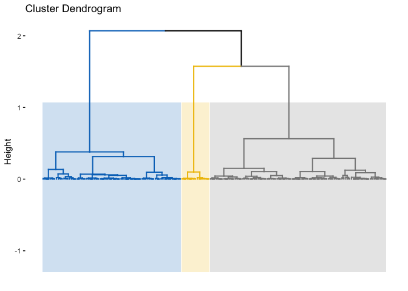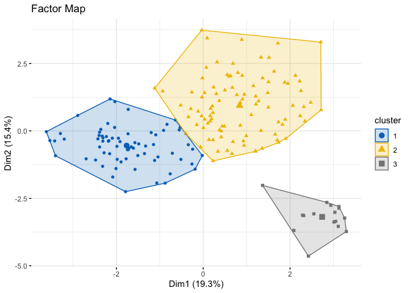

On retrouve bien les 3 clusters que nous avions repérés lors de l’ACP.
Le cluster 1 réunit les individus plus grands consommateurs de viandes,
le 2 les consommateurs plus “mesurés” (consomment poissons, viandes,
féculents et légumes de manière plus équilibrée : ils sont plus au
centre de la factor map) et le 3 les grands consommateurs de légumes.

*Remarque : Le cluster 2 a une cardinalité plus faible que les deux
autres.*

Le choix du nombre de classes est basé sur l’accroissement de l’inertie.
Ici, le partitionnement en 3 classes est intéressant car le passage de 3
à 2 classes conduirait à un accroissement de l’inertie important : les
classes seraient bien moins
homogènes.

<!-- -->

#### Habitudes alimentaires et état de santé par cluster

En évaluant les tendances pour chaque variable supplémentaire en
fonction de chaque cluster, on peut estimer plus facilement l’impact sur
la santé des habitudes alimentaires. On les fait donc correspondre à
chaque graphique représentant les habitudes alimentaires des différents
groupes.

##### Cluster 1 - Grand consommateurs de viande + féculents

Les consommateurs de viandes ont des taux de fer et de vitamines bons
mais un cholesterol trop
élevé.

##### Cluster 2 - Consommateurs “équilibrés”

Les consommateurs “équilibrés” (consomment viandes + poissons de manière
modérée et beaucoup de légumes) ont des taux de et de vitamines moyens
et un cholesterol
bas.

##### Cluster 3 - Végétariens

Les végétariens ont un cholesterol très bas mais des taux de fer et de
vitamines en moyenne trop bas également.

##### Conclusion

Les individus dont les indicateurs de santé sont les plus équilibrés
appartiennent au cluster 2, dont l’alimentation est elle aussi plus
équilibrée. Ils consomment à la fois des légumes, de la viande et du
poisson. Leurs taux de vitamines et de fer sont proches de la normale et
leur cholesterol est bas.

Nous confirmons notre hypothèse supposant que la forte consommation de
viandes a un impact différent, et opposé, sur la
santé.

#### Deuxième Plan Factoriel

Sur les deux dernières dimensions cette analyse ne nous apporte pas
d’information : les clusters se chevauchent et ne font apparaitre
aucun schéma. Les habitudes en ce qui concerne les encas sont donc
similaires dans chaque cluster.

## ADisc

Notre objectif est de déterminer quelles variables ont le pouvoir
discriminant le plus élevé, puis quelles variables décrivent au mieux
les groupes.

À l’aide d’une série de tests de comparaison de deux moyennes on évalue
le pouvoir discriminant de chaque variable ainsi que sa corrélation avec
les différents groupes.

Nous classons ensuite nos résultats en affichant les variables décrivant
le mieux les groupes en premier.

|               | cor\_ratio | wilks\_lamb | F\_statistic | p\_values |
| :------------ | ---------: | ----------: | -----------: | --------: |
| féculent      |  0.6024159 |   0.3975841 |   134.851988 | 0.0000000 |
| légume.racine |  0.4571488 |   0.5428512 |    74.949152 | 0.0000000 |
| légume.vert   |  0.4311051 |   0.5688949 |    67.443646 | 0.0000000 |
| poisson       |  0.3427411 |   0.6572589 |    46.410864 | 0.0000000 |
| fruits.de.mer |  0.3254535 |   0.6745465 |    42.940500 | 0.0000000 |
| porc          |  0.3161015 |   0.6838985 |    41.136274 | 0.0000000 |
| autre.légume  |  0.3018663 |   0.6981337 |    38.482752 | 0.0000000 |
| boeuf         |  0.2522051 |   0.7477949 |    30.016590 | 0.0000000 |
| soda          |  0.2343769 |   0.7656231 |    27.245190 | 0.0000000 |
| poulet        |  0.1783539 |   0.8216461 |    19.319141 | 0.0000000 |
| crudités      |  0.1692116 |   0.8307884 |    18.127156 | 0.0000001 |
| alcool        |  0.0960828 |   0.9039172 |     9.460349 | 0.0001246 |
| encas.sucré   |  0.0548839 |   0.9451161 |     5.168328 | 0.0065793 |
| pâtisseries   |  0.0186698 |   0.9813302 |     1.693224 | 0.1868744 |
| encas.salé    |  0.0171718 |   0.9828282 |     1.554992 | 0.2140461 |

Les 5 variables qui décrivent le mieux les différents groupes sont :

    ## féculent légume.racine légume.vert poisson fruits.de.mer

La plupart des variables ont une p-value extrêmement faible, ce qui
indique qu’un fort pouvoir discriminant leur est attribué.

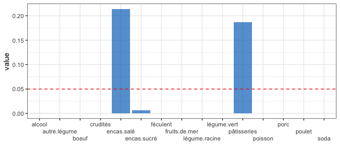<!-- -->

Toutes les variables sont considérées excellentes pour discriminer les
individus en dehors de “encas.salé” et “pâtisseries”. Cela explique
d’autant mieux que le seul premier plan factoriel de notre PCA (qui
ignorait ces variables) discriminait au mieux nos individus.

# Partie 2

On souhaite analyser les discours de personnages politiques. Le jeu de
données est construit autour du lexique des discours des différents
candidats.

On dispose de données sur le nombre d’apparitions de 31 termes dans les
discours de 12 personnages différents. Voilà un extrait de notre jeu de
données
:

|                 | Trèronchon | Artichaud | Bisoux | Jolille | Hameau | Cheminette | … |
| :-------------- | :--------- | :-------- | :----- | :------ | :----- | :--------- | :- |
| sexisme         | 0          | 2         | 0      | 1       | 1      | 1          | … |
| candidature     | 11         | 7         | 5      | 1       | 5      | 1          | … |
| suffrage        | 17         | 11        | 11     | 2       | 9      | 2          | … |
| rassemblement   | 15         | 16        | 9      | 1       | 13     | 5          | … |
| pouvoir d’achat | 15         | 15        | 7      | 3       | 11     | 1          | … |
| dialogue        | 9          | 11        | 6      | 3       | 9      | 1          | … |
| …               | …          | …         | …      | …       | …      | …          | … |

## Vue d’ensemble

**Corrélation entre
candidats**

<!-- -->

On remarque tout de suite les candidats dont les discours se rapprochent
ou s’éloignent lexicalement. Par exemple, les candidats Cheminette,
Lachambre, Méheu et Micron sont tous corrélés positivement. Ils sont par
contre, au contraire, corrélés négativement aux candidats Kärcher,
Dupond et LaPeine. Leurs discours sont opposés lexicalement.

**Corrélations entre
modalités**

<!-- -->

Les corrélations positives (en bleu) indiquent des groupes de mots qu’on
retrouvera fréquemment dans les mêmes discours. À l’inverse, les
corrélations négatives (en rouge) mettent en avant les mots qu’on ne
trouve généralement pas ensemble dans un même discours.

Par exemple “habitant”, “dette”, “transparence” et “écoute” sont souvent
employés ensemble dans des discours, mais apparaissent rarement avec
avec les termes “terrorisme”, “devoir” et “fiscalité” qui eux sont aussi
fréquemment utilisés conjointement lorsqu’ils apparaissent dans un
discours.

## Choix des dimensions

Pour la suite de notre analyse factorielle des correspondances on
souhaite définir les dimensions que nous retiendrons. On se base sur les
valeurs propres :

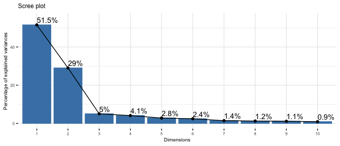<!-- -->

Il est évident de sélectionner les deux premières dimensions (le premier
plan).

## Étude de l’AFC

<!-- -->

L’analyse simultanée des projections des individus et des modalité est
ici très utile.

Des groupes clairs se forment.

  - Dupond, LaPeine et Kärcher qui utilisent plus fréquemment des termes
    comme “fiscalité”, “finance” ou “immigration”
  - Trèronchon, Artichaud, Hameau et Bisoux qui utilisent plus
    fréquemment des termes comme “suffrage”, “égalité” et “peuple”
  - Méheu, Cheminette, Lachambre, Jolille et Micron qui utilisent plus
    fréquemment des termes comme “transparence”, “écoute” et
    “efficacité”

*Il s’agit d’exemples de termes pour aider à l’interprétation du
graphique, mais sa lecture complète est nécessaire pour avoir une bonne
vision des corrélations entre candidats et concurrents ou entre
candidats et champs lexicaux.*

*Remarque : Les individus et les modalités que nous avons précédemment
identifiés comme inversement corrélés sont éloignés les uns des autres
sur la factor map. Cela confirme donc notre première analyse.*

Pour mieux comprendre les attirances et répulsions entre les modalités
on peut étudier la factor map où seules les variables apparaissent.

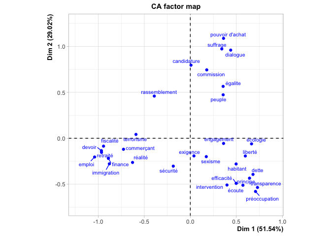<!-- -->

La première dimension oppose les termes comme “fiscalité”, “devoir”,
“emploi”, “finance” (qui sont regroupés sur la partie gauche du
graphique) au groupe de termes comprenant “liberté”, “écologie”,
“engagement”. Sémantiquement on réalise qu’il existe aussi, au sens
commun, une certaine opposition entre ces champs lexicaux.

De même, sur le deuxième axe le groupe comprenant
“candidature,”commission" et “suffrage” est opposé aux termes
“sécurité”, “intervention”, “efficacité”. L’interprétation est ici
moins intuitive. Il est de toute façon préferable d’avoir une vue 2D de
ces données pour bien se représenter les interactions entre les
modalités.

## Khi2

Essayons de définir si des dépendances existent entre les variables du
jeu de données.

*Intuitivement, et au vu de la factor map, il est évident de considérer
que des dépendances existent. C’est pourquoi nous faisons l’hypothèse
nulle qu’aucune dépendance
n’existe*

|                 | Trèronchon | Artichaud | Bisoux | Jolille | Hameau | Cheminette | … |
| :-------------- | :--------- | :-------- | :----- | :------ | :----- | :--------- | :- |
| sexisme         | 1.29       | 1.18      | 0.9    | 1.8     | 0.9    | 0.95       | … |
| candidature     | 3.96       | 3.63      | 2.77   | 5.54    | 2.77   | 2.92       | … |
| suffrage        | 5.7        | 5.24      | 3.99   | 7.99    | 3.99   | 4.21       | … |
| rassemblement   | 10.58      | 9.72      | 7.41   | 14.81   | 7.41   | 7.8        | … |
| pouvoir d’achat | 5.34       | 4.9       | 3.74   | 7.47    | 3.74   | 3.94       | … |
| dialogue        | 4.05       | 3.72      | 2.83   | 5.67    | 2.83   | 2.99       | … |
| …               | …          | …         | …      | …       | …      | …          | … |

On voit que les effectifs ne sont pas tous \>5. Nous ne pourrons pas
utiliser ce test pour déterminer l’éventuelle dépendance des variables.

On peut toutefois calculer les contributions du X2 de chaque effectif
(représenté ici par une heatmap car illisible autrement)
:

<!-- -->

Aucun effectif ne se détache.

Puisque le test du X2 n’est pas applicable, on peut se rabattre sur le
coefficient de Cramer. Si celui-ci est significativement différent de 0,
alors on conclut à la non-indépendance des variables.

On choisit un niveau de significativité de \(\alpha\)=5%.

|          |           |
| :------- | --------: |
| Cramer V | 0.2650033 |
| lwr.ci   | 0.2149416 |
| upr.ci   | 0.2455010 |

L’indice de Cramer est significativement différent de 0 et l’intervalle
ne contient pas 0. On peut conclure, au seuil de significativité
\(\alpha\)=5%, que le jeu de données contient au moins deux variables
dépendantes.

## Analyse de discours types

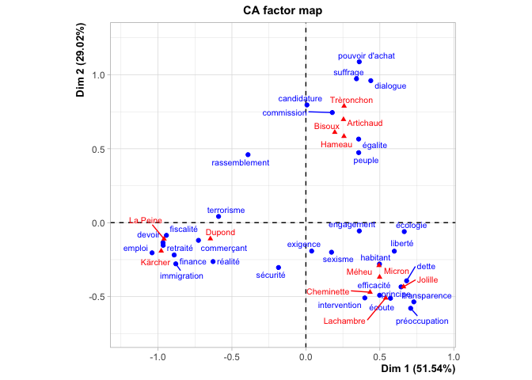<!-- -->

Si nous prenons comme exemples les discours de Trèronchon et Lapeine, on
identifie immédiatement une oppositon lexicale. LaPeine utilise beaucoup
des termes comme “devoir”, “emploi”, “fiscalité” et “finance”, ce qui
laisse imaginer que l’économie joue un rôle important dans ses
interventions. En revanche Trèronchon utilise plus des termes comme
“suffrage”, “égalité”, “dialogue” ou “peuple”, ce qui laisse penser
que ses discours sont plus tournés vers l’humain.

Étudions plus précisément le contenu des discours de **Trèronchon** et
**LaPeine**

### Discours de Trèronchon

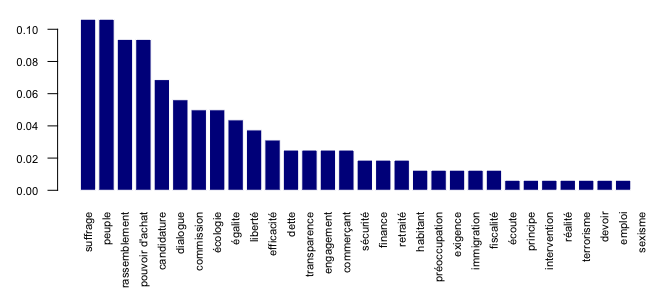<!-- -->

“suffrage” et “peuple” sonts les mots qu’on retrouve le plus dans les
discours de Trèronchon. Deux termes sont quasiment aussi fréquents :
“rassemblement” et “pouvoir d’achat”.

On remarque que la distribution des mots n’est pas très équilibrée et
que une petite partie de ces mots revient bien plus fréquemment que les
autres. Le discours doit être tourné fortement autour de ces concepts.

### Discours de LaPeine

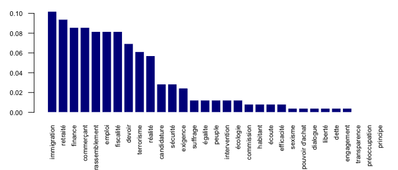<!-- -->

Le terme “immigration” est le plus utilisé dans les discours de LaPeine,
principalement accompagné des termes “retraité”, “finance”,
“commerçant”, “rassemblement”, “emploi” et “fiscalité”.

En revanche elle ne mentionne pas “transparence”, “préoccupation” et
“principe”, et très peu “engagement” ou “liberté”.

Les discours de LaPeine semblent un peu plus divers que ceux de
Trèronchon et emploient de manière fréquente un nombre plus important
de mots.

## Projections de termes

*Nuage de mots dont la taille est proportionnelle au nombre
d’apparitions dans les discours de tous les candidats confondus*

<!-- -->

Sur l’ensemble des discours analysés, tous candidats confondus, les
termes prédominants sont “rassemblement” et “écologie”. Au contraire, le
moins employé est “sexisme”.

Étudions plus précisément les apparitions des termes **Dette**,
**Suffrage** et la projection du terme **Écologie**.

### Dette

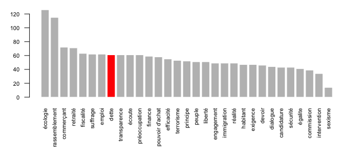<!-- -->

Il s’agit du 8ème terme le plus utilisé (tous discours confondus).

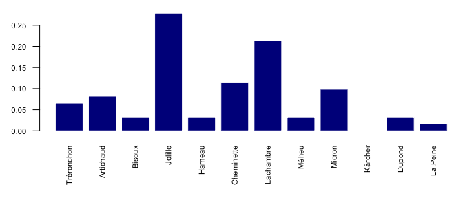<!-- -->

Jolille, Lachambre, Cheminette et Micron sont les plus grands
utilisateurs du mot “Dette”. Ils sont d’ailleurs proches les uns des
autres sur la factor map de l’analyse factorielle, ce qui indique que
“Dette” pourrait être un bon terme pour discriminer les individus.

### Suffrage

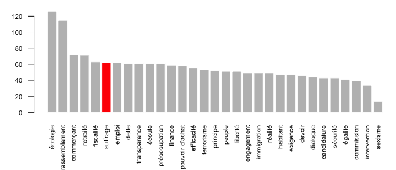<!-- -->

Il s’agit du 6ème terme le plus utilisé (tous discours confondus).

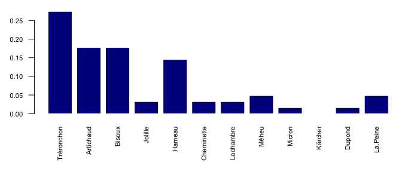<!-- -->

Trèronchon, Artichaud, Bisoux et Hameau sont les plus grands
utilisateurs du mot “Suffrage”. Tout comme pour le terme “Dette”, il
s’agit de personnes regroupées sur la factor map de l’analyse
factorielle. Il s’agit également d’un terme potentiellement utile pour
discriminer les individus.

### Écologie

C’est le terme qui revient le plus souvent si on considère l’ensemble
des discours.

|    | word            | freq |
| :- | :-------------- | :--- |
| 31 | écologie        | 126  |
| 4  | rassemblement   | 115  |
| 28 | commerçant      | 72   |
| 29 | retraité        | 71   |
| 30 | fiscalité       | 63   |
| 3  | suffrage        | 62   |
| 26 | emploi          | 62   |
| 12 | dette           | 61   |
| 13 | transparence    | 61   |
| 14 | écoute          | 61   |
| 15 | préoccupation   | 61   |
| 27 | finance         | 59   |
| 5  | pouvoir d’achat | 58   |
| 17 | efficacité      | 55   |
| 24 | terrorisme      | 53   |
| 16 | principe        | 52   |
| 9  | peuple          | 51   |
| 11 | liberté         | 51   |
| 18 | engagement      | 49   |
| 22 | immigration     | 49   |
| 23 | réalité         | 49   |
| 10 | habitant        | 47   |
| …  | …               | …    |

Il s’agit d’un mot employé souvent avec des termes comme “liberté” et
“engagement”, ce qui parait plausible. Au contraire, il est rare qu’il
apparaissent dans le même discours que les termes “fiscalité” ou
“emploi”.

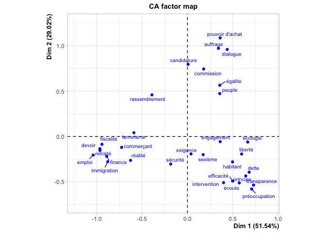<!-- -->
